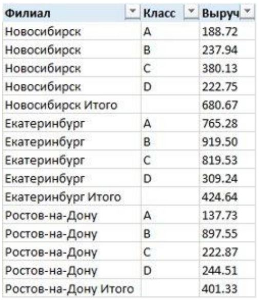
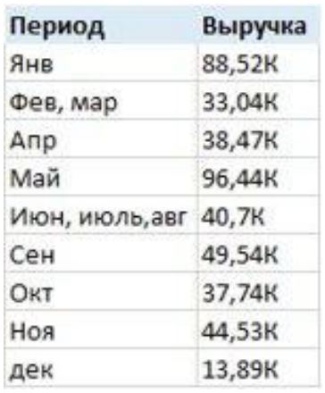
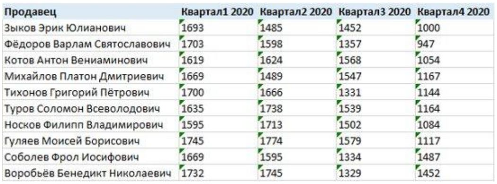
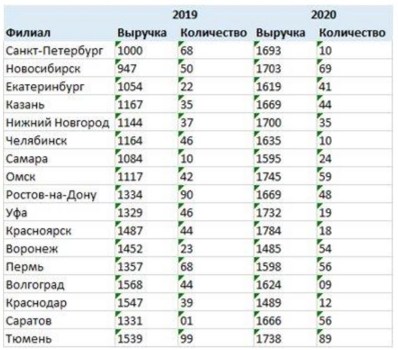
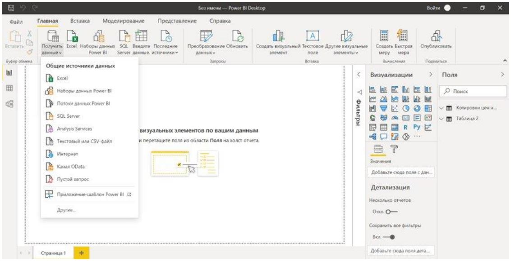
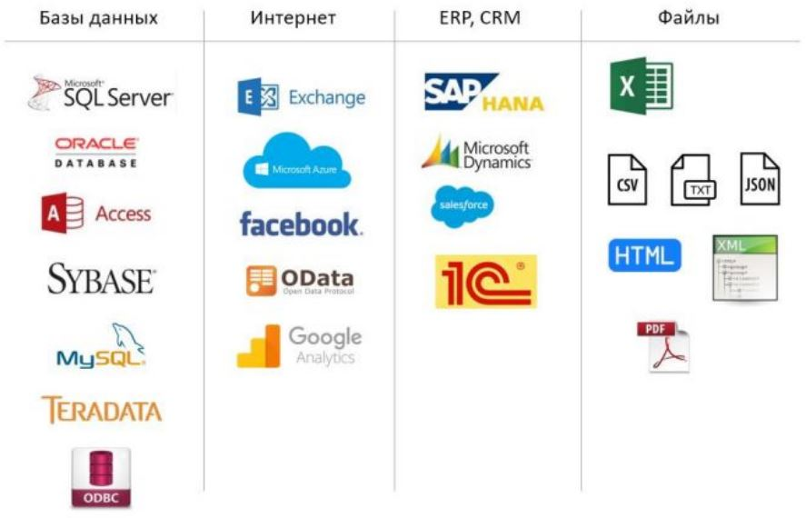
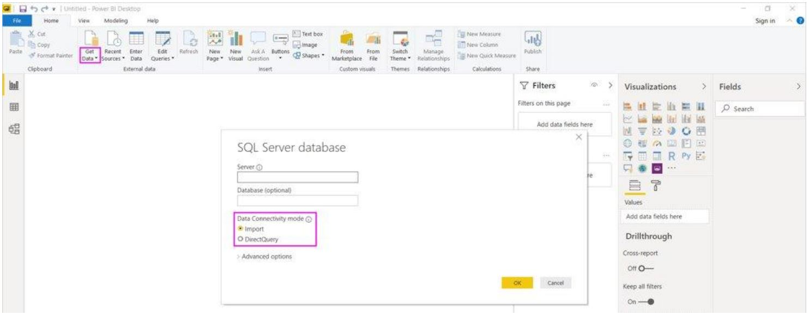
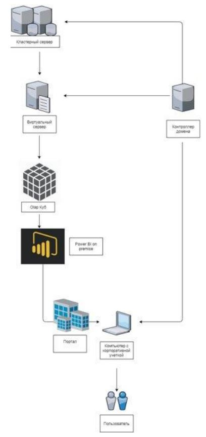

# Урок 8. Power BI - Power Query

# Что такое Power Query и зачем он нужен

— это алгоритм для создания набора данных.

+ С помощью Power Query можно создавать ETL процесс,
+ Доступен в Excel и Power BI,
+ Аналитики тратят до 80% времени на подготовку данных

# Что умеет Power Query

+ Загружать данные для дальнейшей проработки
+ Консолидировать данные из нескольких листов, папок, файлов
+ Трансформировать загруженные данные: сортировать, фильтровать, группировать, сворачивать и так далее 
+ Объединять таблицы между собой
+ Работать с разными форматами:
    + зачистка,
    + исправление регистра,
    + удаление лишних пробелов
    и так далее
+ Выполнять простые вычисления с данными включая логику ЕСЛИ)

# Что не умеет Power Query

+ Редактировать загруженные данные напрямую. Если менять данные, то только в источнике
+ Производить сложные вычисления (математические и статистические)
+ Визуализировать. Power Query не про визуализацию, а про данные.

# Принцип табличности и что такое качественные данные

## Алгоритм создания набора данных
1. Выбор данных
    + подключаемся к источнику данных
2. Трансформация (очистка) данных
    + Приводим данные к необходимому виду
3. Загрузка данных
    + Определяем, какие именно данные в табличном виде понадобятся к загрузке

## Что считается таблицей

Все данные на выходе должны быть в виде таблицы:
+ Одна строка = одно событие или объект,
+ Столбцы содержат сравнимые показатели,
+ Для данных в столбце осмысленная арифметическая операция,
+ Нет объединений,
+ Таблица состоит из списка заголовков и списка списков значений.

## Давайте определим,таблица это или нет

Не таблица, так как тут имеются итоговые значения

Не таблица, так как тут есть пустые значения, надо протянуть ответственного.

Не таблица, так как не соблюден принцип "одна строка - одно событие, если ввести отдельные значения для Июня, июля и августа, то это станет таблицей

Это таблица!

Не таблица, так как два уровня заголовков и группировка.

# Источники данных

## Какие есть коннекторы данных в Power BI

## Откуда можно загрузить данные

## Принцип универсального подхода

1. Загрузка данных + Обработка/Трансформация + Выгрузка данных + Обновление = Запрос
2. Работа с шагами запроса должна быть максимально универсальной
3. Мы должны стремится к таким решениям, чтобы при изменении исходных данных не менять запрос
4. Структура данных не должна меняться: порядок столбцов, названия столбцов, название файла или витрины

## Методы забора данных

## Метод забора данных

### Import
+ Загружает все данные из базу внутрь Power BI 
+ Больше весит файл pbix 
+ Подходит для работы с данными внутри Power BI

### Direct Query
+ Запрашивает данные напрямую из источника 
+ Файл pbix весит мало 
+ Вся работа с данными должна быть проделана до Power BI

## Пример архитектуры с Direct Query

# Практика

## 1-я часть работ: подготовка данных
1. Скачайте данные по ссылке : 
    https://docs.google.com/spreadsheets/d/152JyksagijqyscnrFDc6Ez2VjT5MKNXpDOyc4PRlauw/edit#gid=208646510

При погрузке данных «edit#..........» замените на «export?format=xlsx»
2. Выделите в Маркетинговых данных признак марки и модели автомобиля
3. Удалите не нужные значения в CRM
4. Надписи в справочнике приведите к единому знаменателю
5. Загрузите данные по курсам валют на дату с сайта ЦБ РФ
